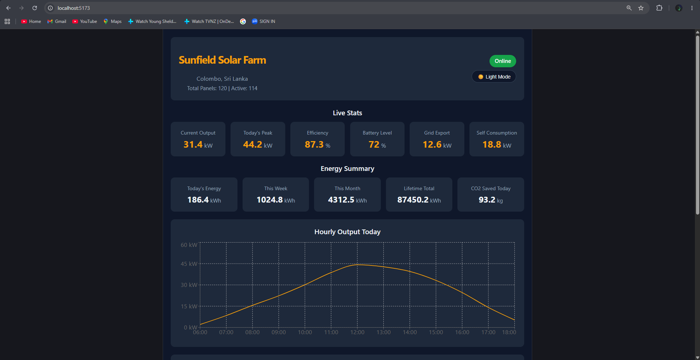
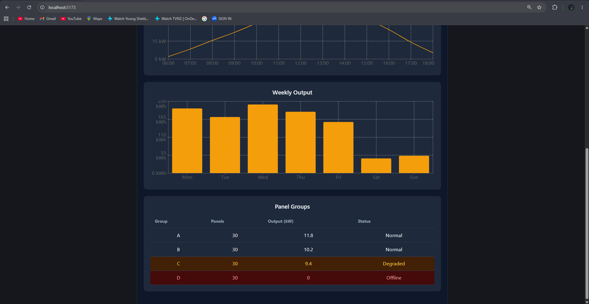
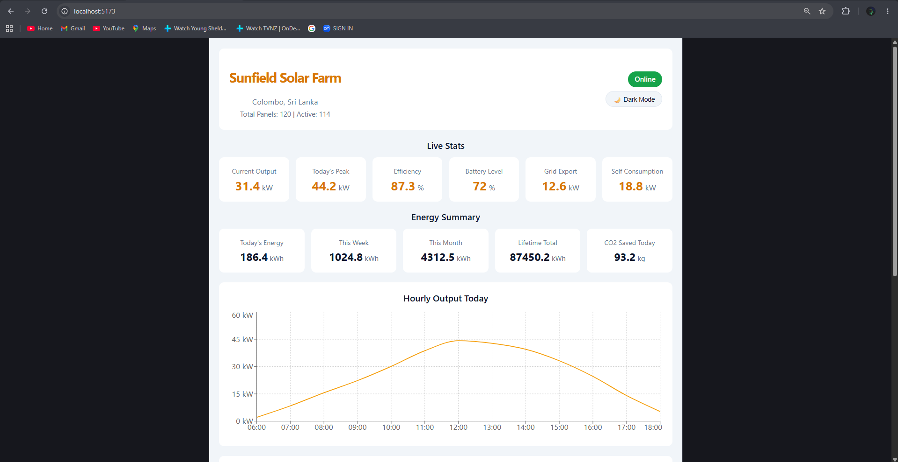
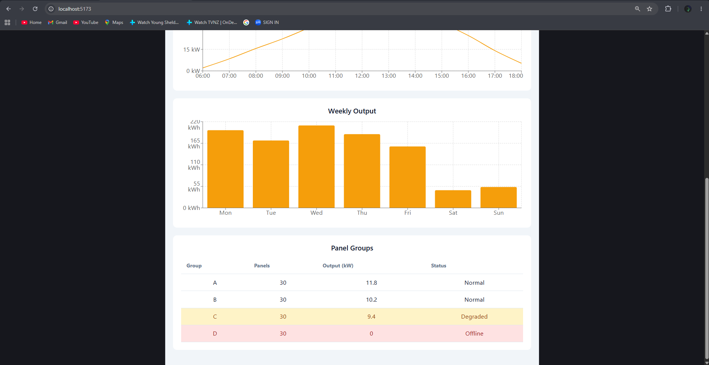

# Solar Power Monitoring Dashboard

A read-only Solar Power Monitoring Dashboard built with React and Vite. All data is hardcoded. No backend, no API calls.

## Features

- Site header with live status badge
- Live stats cards showing current output, efficiency, battery level and more
- Energy summary tiles for today, this week, this month and lifetime
- Hourly output line chart using Recharts
- Weekly output bar chart using Recharts
- Panel group table with color coded status rows
- Dark and light mode toggle using React Context API

## Screenshots






## How to Run

1. Clone the repo
2. Navigate into the project folder
3. Install dependencies
4. Start the dev server

```bash
git clone https://github.com/o4ion/solar-dashboard.git
cd solar-dashboard
npm install
npm run dev
```

Then open http://localhost:5173 in your browser.

## Tech Stack

- React
- Vite
- Recharts
- CSS Variables for theming

## Decision Note

I structured the dashboard by giving each section its own component and passing all data via props from App.jsx. This keeps each component focused on one job and makes the code easy to follow. For dark mode I used React Context API so the theme state is accessible anywhere without prop drilling. I chose Recharts for the charts because it integrates naturally with React and handles responsiveness out of the box.